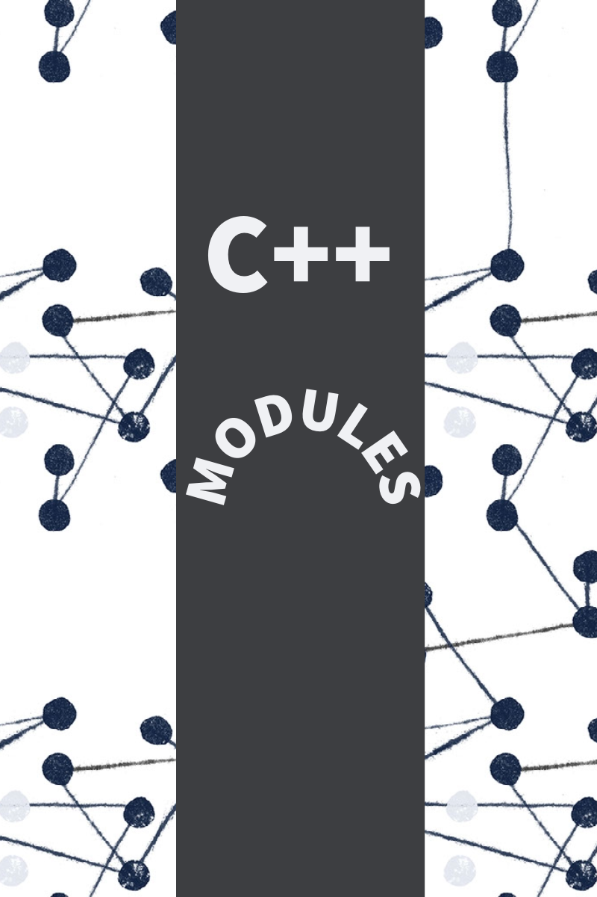

#

Welcome to the C++ modules repository from 42 School. These modules focus on teaching core C++ concepts.

## Modules

1. Module cpp05
2. Module cpp09

Each module has its own README with detailed instructions.

## Thank you for your support!

